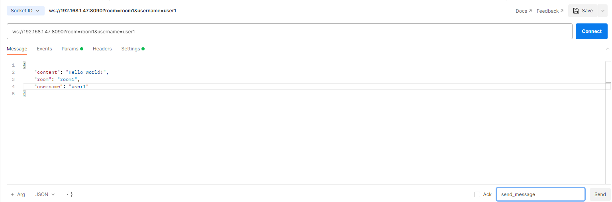

# socketio-server-demo
[Socket.io](https://socket.io/) Server with Spring Boot

### Techs & Specs
    - Java 17 & SpringBoot 3
    - Socket.io
    - H2 Database
    - Docker

### HOW TO

Connect Socket Server via Postman
   - Select "Socket.IO"
   - ws://<APP_LOCAL_IP>?room=<ROOM_NAME>&username=<USER_NAME>
   - Choose client version "V2" from "Settings"
   - Connect
   - Write your JSON request inside message with required parameters
   - Event Name --> send_message (default: message)
   - Send

